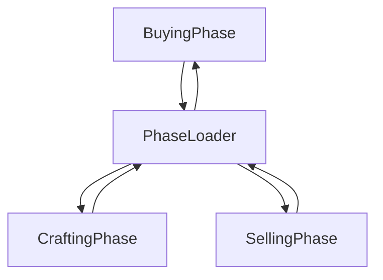

# Fantasy Battle Defense Dealer
https://github.com/JNetoGH/Farm-Game

João Neto (a22200558):
- desenvolvimento da game  engine
- arquitetura do game
- desenvolvimento do controle de fluxo do game
- desenvolvimento geral dos GameObjects

Margarida Teles (a22204247):
- desenvolvimento das artes para UI
- assistência no desenvolvimento dos craftings
- assistência nas layers
- assistência na criação dos NPCS

## GAME-ENGINE
O jogo está separado em duas pastas principais, a game engine, criada por João Neto usando a biblioteca pygame e a pasta jogo de fato, criado usando GameObjects

O jogo deve ser rodado pelo main.py

## FLUXO DO JOGO
- O fluxo do game é composto por 3 fases (BuyingPhase, CraftingPhase, SellingPhase), um PhaseLoader e um PhaseController.
- O PhaseController é quem realmente gerencia o fluxo do game, já o PhaseLoader, é apenas uma fase intermediária onde se tem de interagir com o RegisterBook, pressionando a tecla E para se dar início a próxima fase

PhaseLoader:

# BUYING PHASE
- A explicação do funcionamento é simples, caso o player tenha dinheiro suficiente, a quantidade comprada é adicionada ao item no inventário de recursos do jogador.

## CRAFTING PHASE
- A fase de crafting permite que o jogador faça itens a partir de receitas, cada craft possui uma taxa de sucesso, o valor da tentativa do jogador é calculado tendo em base o nível dele * um número aleatório de 1 a 6.
- Caso o craft falhe, os itens serão consumidos da mesma forma.
Caso tenha sucesso, o jogador ganha mais experiência
- Craft() é um método pertencente ao game Object Recipe que funciona da seguinte forma:
  - checks if there is enough of all the required resources in case not, just returns
  - reduces the amount of the required resource at the player's inventory
  - if player attempt fails, those resources are consumed anymay, but the output crafting item is not generated
  - dds up the amount of the recipe to the inventory

## SELLING PHASE
Esta fase funciona de forma mais complexa, pois seu funcionamento gera um subsistema de demanda para os produtos que o player pode vender, alterando os valores que os compradores estão dispostos a dar, a sua ordem de execução é a seguinte:

### Sistema de Demanda
- Gera uma lista com um valor de enumerator Demand para cada item que o jogador pode vender
- A demanda pode ser de valor Demand.Low, Demand.Normal ou Demand.High
- Em cada Selling Phase uma nova onda de demandas para cada produto é gerada de foma aleatória
- caso a demanda para aquele tipo de item seja Demand.Low: os Npcs pagarão entre 1/3 á 1/5 (gerado aleatóriamente) a MENOS pelo produto
- caso a demanda para aquele tipo de item seja Demand.Normal: os Npcs pagarão o valor base do produto
- caso a demanda para aquele tipo de item seja Demand.High: os Npcs pagarão entre 1/3 á 1/5 (gerado aleatóriamente) a MAIS pelo produto

### Restante da SellingPhase
Ao terminar da geração de demandas para cada tipo de produto, um número aleatório de NPCS são gerados no mapa, quando o player chega em seus retangulos de interção, caso o player possua o item que eles desejam, pode vende-lo pressionando E:
  

Cada Npc spawnado faz sua oferta de compra de acordo com o sistema de demanda já mencionado, e sua posição no mundo é gerada aleatóriamente dentro de uma lista pré-definida, sendo a mesma tratada de forma a que nenhum NPC seja instanciado na mesma posição.
O número de Npcs gerado é de 5 a 8

## CONDIÇÃO DE VITÓRIA
ao chegar em 1000 moedas o player vence o jogo, (pro-tip: toda vez que se pressionar M ganha-se 100 moedas, é para debugging)

